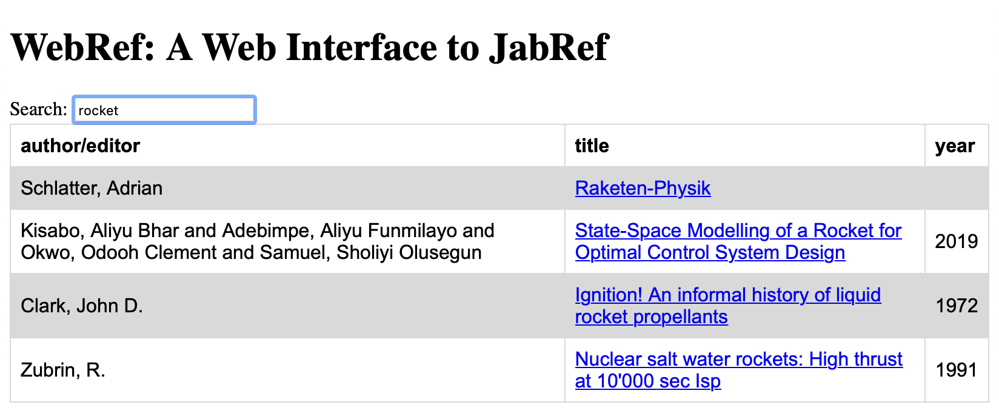

# WebRef

WebRef is a web interface to a [JabRef SQL database](https://docs.jabref.org/collaborative-work/sqldatabase).
It allows you to access your references from anywhere in the world and from
any device with a web browser. You do not need to install Java, you
do not need to install an app. Any non-archaic phone, tablet, PC, Mac, or
Raspberry Pi will do.

Create a JabRef database (using your normal JabRef) and configure WebRef 
to point to this database. Voila: Your references just became accessible
worldwide.

Note: WebRef provides *read-only* access to your library. To add, edit, or
delete entries from your library, you still need a standard JabRef installation
somewhere.

<p align="middle">

</p>


## Installation

You need:

* JabRef: To create, edit, and extend your library
* Docker: To create and run docker images


Steps:

* Clone this repo
* Create a suitable docker-compose.yml (use
  [docker-compose_templ.yml](../docker-compose_templ.yml) as a starting point)
* Create the following text files (assuming you did not change the paths
  from the template docker-compose.yml):
  - ./secrets/sqlusername: Username used to access your JabRef database
  - ./secrets/sqlpassword: Password for that username
  - ./secrets/sqlserver: The sql server holding your JabRef database
  - ./secrets/sqldatabasename: The name of your JabRef database 
* Run ```docker-compose up```
* Point your webbrowser to localhost:7000 (or where you configured your
  WebRef to be)

This will start WebRef on your local machine which is nice for testing.
To get the most out of WebRef, you will probably want to
run this docker image on a web server.

As we have not created any users yet, we can't login. To create
users, open your JabRef database (the one named in ./secrets/sqldatabasename)
and run this sql-code (make sure you don't have a table with this name
already):

```
create table user (
	id INT auto_increment,
	username varchar(20) character set utf8 not null,
	password char(80) character set ascii not null,
	primary key (id),
	unique(username)
)
```

Now we have a user table but no users in it, yet. Let's find a password and hash
it with the following python code (of course, we replace the dummy password
with your own password beforehand):

```
import bcrypt

password = 'This is my password'

bytes = password.encode('utf-8')
salt = bcrypt.gensalt()
print(bcrypt.hashpw(bytes, salt))
```

The output looks something like this:

```
b'$2b$12$1royHRBq6o/mbDdO7LjR8eaThWYErI6HLLdn7MBfajtpRLlwWSJ8m'
```

Now add your user to the user table in you JabRef database using this sql-code
(again, replace "webref" with your username and the password hash with the
hash you generated above):

```
insert into user (username, password)
values (
	"webref",
	"$2b$12$1royHRBq6o/mbDdO7LjR8eaThWYErI6HLLdn7MBfajtpRLlwWSJ8m"
);
```

Now we are ready to go.
